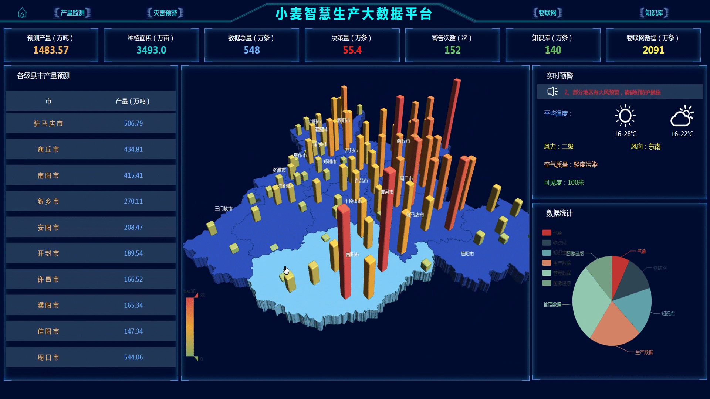
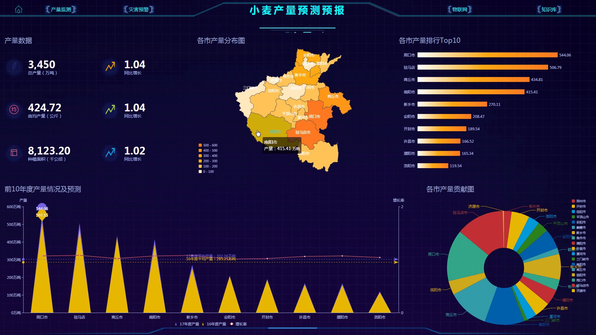
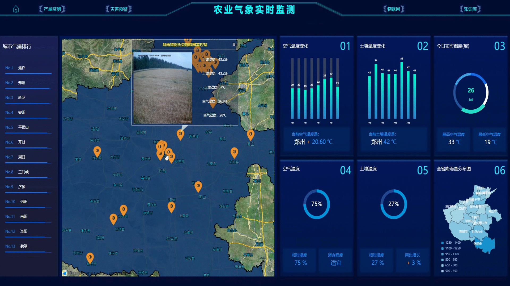
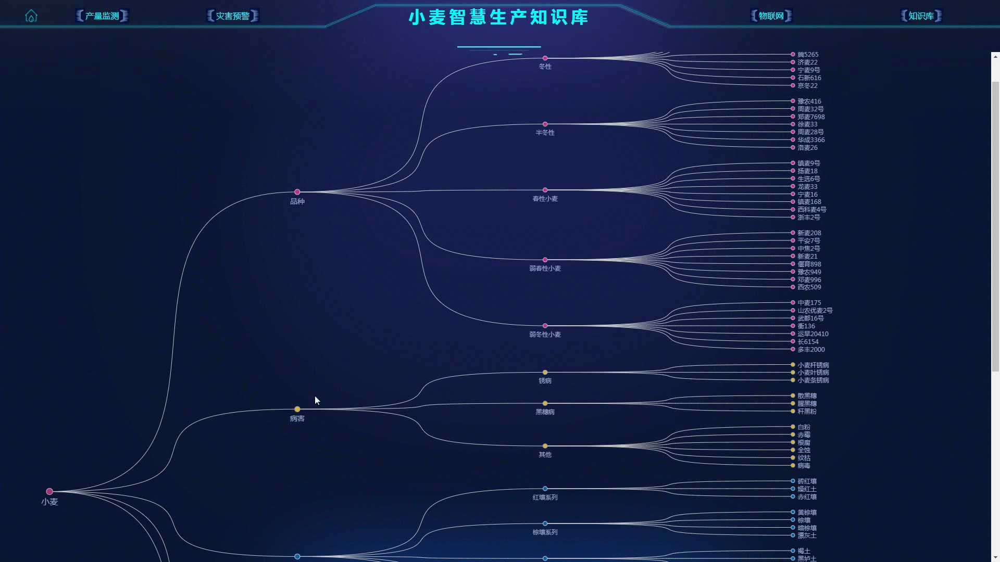
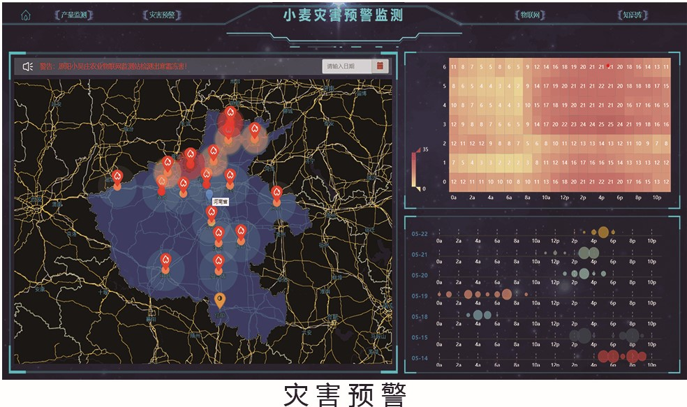

### 小麦智慧生产大数据平台

#### 项目目的
集成互联网抓取、大数据技术，实现小麦生产数据的自动化获取、存储、计算、分析；
融合多源数据，实现小麦生产全过程产量预测、灾害预警与动态可视化展示。

#### 技术架构(因项目保密原因，只展示部分)
- 采用SpringCloud(Greenwich.SR1)微服务架构。
    - 数据可视化
    - 定时模块
    - 爬取模块
    - 服务注册
    - 品种推荐(不在本仓库)
    - 精确施肥(不在本仓库)
  
前后端分离，利用Ajax异步请求  
  
- 前端
    - 用echarts实现图表以及3D地图
    - 用高德地图API实现地图上的操作
    
- 后端
    - 使用SpringBoot对数据进行CRUD
    - 使用随机森林算法(Python)预测小麦产量
    - 利用HttpClient实现对气象数据的定时爬取

#### 效果图

平台首页

产量预测

气象监测

知识库

灾害预警

